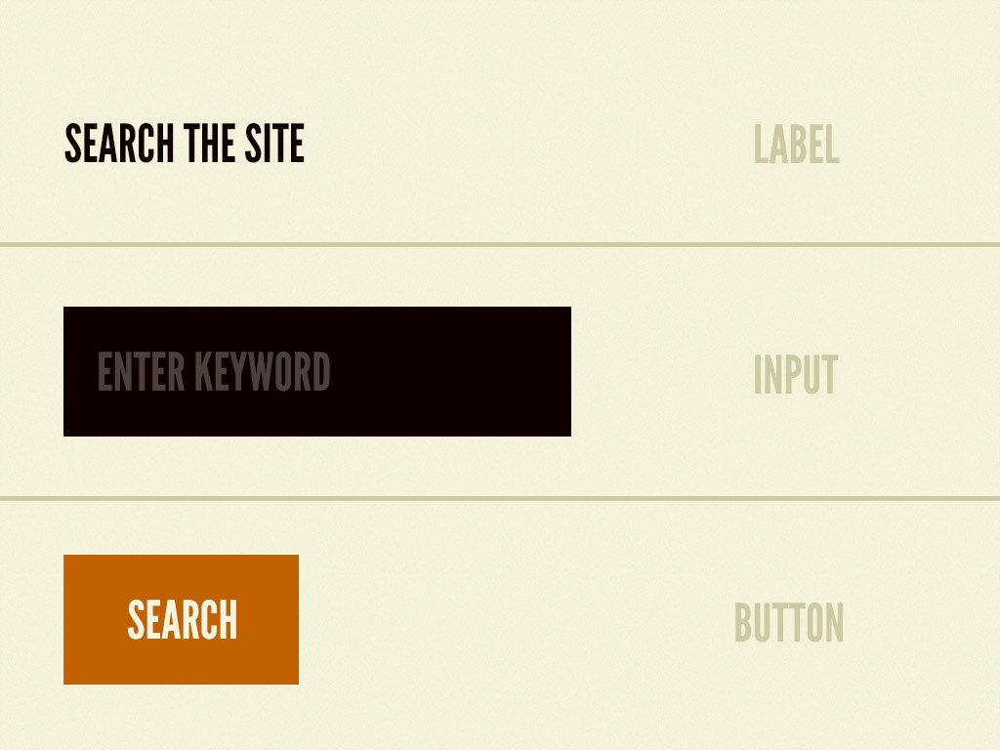
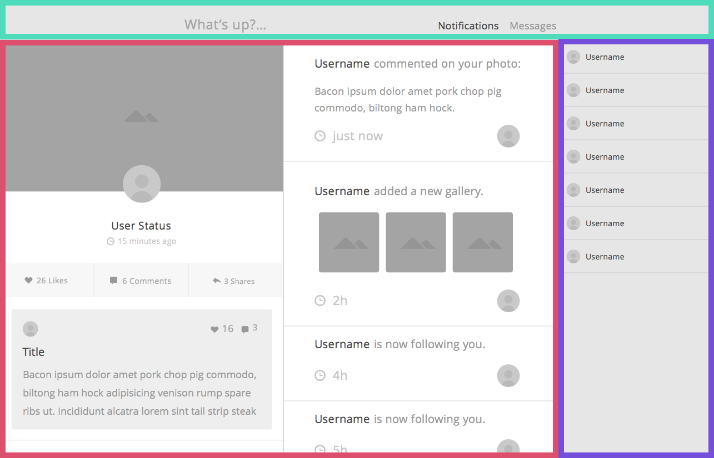
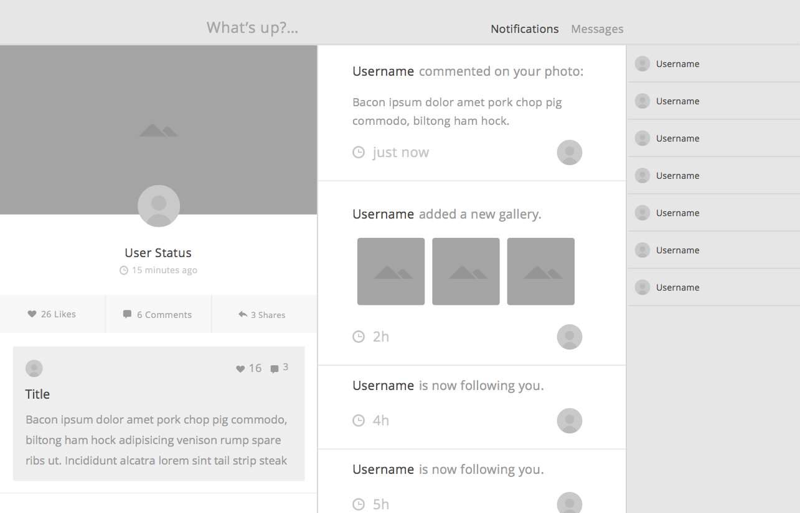

# Atomic Component Principles


## Atoms



- The simplest building block
- HTML tags
- Not very useful on their own
- Easily styled
- Very reusable
- Foundation of building a brand

```html
<Form>
  <Label>Search</Label>
  <Input />
</Form>
```


## Molecules


- Groups of Atoms bonded together
- Serve as backbone of design system
- For example, a Search Form
- Do one thing, do it well

```html
<Form onSubmit={ onSubmit }>
  <Label>Search</Label>
  <Input type="text" value={ search } />

  <Button type="submit">Search</Button>
</Form>
```


# Organisms


- Groups of molecules
- Distinct section of an interface
- Portable, easily modified

```html
<Header>
  <Navigator>
    <Brand />
    <NavItem to="home">Home</NavItem>
    <NavItem to="about">About</NavItem>
    <NavItem to="blog">Blog</NavItem>
  </Navigator>
  <SearchForm />
</Header>
```


# Ecosystem



- What the client will see
- Connected containers
- Many components that make up a view


# Environment



- Root Component
- Typically the `<App />` component
- Represents everything packaged together as an application


---

Images from:
- Brad Frosts's article, [Atomic Design](http://bradfrost.com/blog/post/atomic-web-design/)
- Joey Di Nardo's article, [Atomic Components: Managing Dynamic React Components using Atomic Design — Part 1](https://medium.com/@yejodido/atomic-components-managing-dynamic-react-components-using-atomic-design-part-1-5f07451f261f#.9b2faky8s).
